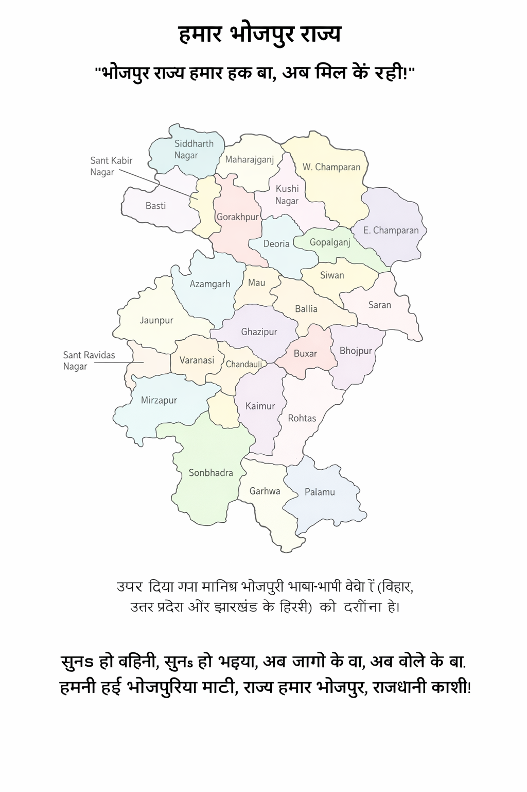

# हमार भोजपुरी राज्य

सुनs हो बहिनी, सुनs हो भइया,  
अब जागे के बा, अब बोले के बा।  
हमनी हईं भोजपुरीया माटी,  
राज्य हमार भोजपुरी, राजधानी काशी!

बाबा बिसनाथ के आशीर्वाद बा,  
माई विंध्यवासिनी के दुलार बा।  
माई गंगा के निर्मल धार बा,  
संस्कृति, धरोहर, सहेज अपार बा।

**बक्सर, भोजपुरी, रोहतास के शान,**  
**केमूर, सासाराम के माटी महान।**  
**सारण, सिवान, गोपालगंज के चर्चा,**  
**चौपारण के धरती बलिदान के परचा।**

**बलिया, गाजीपुर, मऊ के गरिमा,**  
**देवरिया, कुशीनगर, गोरखपुर के महिमा।**  
**आजमगढ़, महाराजगंज, सिद्धार्थ नगर,**  
**बस्ती, संत कबीर नगर के उजास अमर।**

**चंदौली, जौनपुर, मिर्जापुर के साथ,**  
**वाराणसी हमनी के श्रद्धा के नाथ।**  
**संत रविदास नगर, सोनभद्र के जोश,**  
**गड्ढा, पलामू के माटी भी रोश।**

**माई गंगा, घाघरा, सोन के धार,**  
**कोसी, गंडक के अपार बहार।**  
**कमिनाशा, रिहंद, तोन्स के संचार,**  
**सरयू गंडकी, छोटी गंगा के प्यार।**

हम भोजपुरीया बेटी-बहिनी के गरिमा,  
संस्कृति, संस्कार, शान के महिमा।  
मेहनत से रोज रचें इतिहास,  
अब भोजपुरी के मांग के करे शुरुआत!

भइया लोग, अब हाथ बढ़ावs,  
अब भोजपुरी के हक ले आवs।  
अब ना दबs, अब ना झुकs,  
अब भोजपुरी राज्य के मांग ना छोड़s!

गूंज रहल बा हर गाँव-नगर, कहलें धर्मेंद्र कुमार  
**अब भोजपुरी राज्य हमार अधिकार!!**

सुनs हो बहिनी, सुनs हो भइया, अब जागे के बा, अब बोले के बा।  
हमनी हईं भोजपुरीया माटी, राज्य हमार भोजपुरी, राजधानी काशी!

# हमार भोजपुरी राज्य

## 📜 भोजपुरी राज्य के जरूरत काहे बा? (एक विस्तृत आ गहन विश्लेषण)

भोजपुरी क्षेत्र के जनता बरिसन से राजनीतिक, आर्थिक, सांस्कृतिक आ औद्योगिक रूप से उपेक्षित रहल बिया।  
भोजपुरीया लोगन के अपना भाषा, रोजगार, शिक्षा आ बुनियादी सुविधन खातिर लगातार संघर्ष करे के पड़ता।  
जब झारखंड, उत्तराखंड, छत्तीसगढ़ आ तेलंगाना जइसन राज्य बन सकेला,  
त भोजपुरी राज्य काहे नइखे बन सके?  
एह लेख में भोजपुरी राज्य के जरूरत के हर पहलू से गहराई से समझल जाई।

---

## 🔷 1️⃣ भोजपुरीया पहचान के सुरक्षा आ भाषा के सम्मान

भोजपुरी भाषा 25 करोड़ से अधिक लोग बोलेला, लेकिन एकरा आजो तक संवैधानिक मान्यता ना मिलल।

✅ भोजपुरी भाषा विश्व स्तर पर प्रसिद्ध बा, लेकिन भारत में संविधान के आठवीं अनुसूची में अबहीं तक शामिल नइखे भइल।  
✅ बिहार में मैथिली, मगही, अंगिका जइसन भाषा के सरकारी मान्यता मिलल बा, लेकिन भोजपुरी के अनदेखी भइल बा।  
✅ भोजपुरी में भिखारी ठाकुर, राहुल सांकृत्यायन, महेंद्र मिश्र, भूपेंद्र नाथ रेणु जइसन रचनाकार लोगन के योगदान रहल बा।  
✅ अगर भोजपुरी राज्य बन जाई, त भोजपुरी के सरकारी मान्यता मिली आ एकरा स्कूल-कॉलेज में पढ़ावल जाई।  
✅ भोजपुरी सिनेमा, लोकगीत, बिरहा, बिरसिया, नाटक आ साहित्य के संरक्षण आ संवर्धन मिली।

---

## 🔷 2️⃣ आर्थिक पिछड़ापन दूर करे खातिर भोजपुरी राज्य जरूरी बा

भोजपुर क्षेत्र में अपार प्राकृतिक संसाधन बा, लेकिन विकास नइखे भइल।

### 🔴 (A) कृषि आधारित अर्थव्यवस्था

👉 भोजपुरी क्षेत्र के मुख्य फसल:  
गेहूं, धान, गन्ना, दलहन, तिलहन, आलू, प्याज, मिर्च, मसाला, फल-सब्जी।

👉 अगर भोजपुरी राज्य बन जाई, त:  
✔ फूड प्रोसेसिंग यूनिट, कोल्ड स्टोरेज आ आधुनिक कृषि अनुसंधान केंद्र खुली।  
✔ गन्ना उत्पादन वाला इलाका में नई चीनी मिल खुली।  
✔ डेयरी उद्योग, पोल्ट्री फार्म आ मत्स्य पालन के बढ़ावा मिली।

---

### 🔴 (B) खनिज संपदा आ उद्योग

👉 भोजपुरी क्षेत्र में कोयला, लौह अयस्क, चूना पत्थर, ग्रेनाइट, बॉक्साइट, बालू, सिलिका भरपूर बा।

---

सुनs हो बहिनी, सुनs हो भइया, अब जागे के बा, अब बोले के बा।  
हमनी हईं भोजपुरीया माटी, राज्य हमार भोजपुरी, राजधानी काशी!

# हमार भोजपुरी राज्य

👉 **अगर भोजपुरी राज्य बन जाई, त:**

✔ सीमेंट उद्योग, स्टील प्लांट, बिजली प्लांट, स्टोन क्रशर, खनिज प्रसंस्करण इकाई लागावल जाई।  
✔ खनिज संसाधन के सही इस्तेमाल से रोजगार बढ़ी।

---

## 🔴 (C) वस्त्र और हस्तशिल्प उद्योग

👉 बनारसी साड़ी, भदोही के कालीन, गाजीपुर के जूट, कैमूर के पत्थर के उद्योग बा।

👉 **अगर भोजपुरी राज्य बन जाई, त:**

✔ हथकरघा, टेक्सटाइल, कालीन उद्योग के सरकारी सहयोग मिली।  
✔ नई टेक्सटाइल पार्क, निर्यात केंद्र, सिल्क मिल खुली।

---

## 🔴 (D) व्यापार और परिवहन सुविधा

👉 भोजपुरी क्षेत्र के व्यापार मुख्य रूप से कृषि और हस्तशिल्प पर आधारित बा।

👉 **अगर भोजपुरी राज्य बन जाई, त:**

✔ नए एक्सप्रेसवे, रेलवे कॉरिडोर, बंदरगाह लिंक बनावल जाई।  
✔ बक्सर, बलिया, गाजीपुर, सोनभद्र, चंदौली में व्यापारिक हब तैयार होई।

---

## 🔷 3️⃣ बेरोजगारी आ पलायन के रोकथाम

✅ भोजपुरी क्षेत्र के लाखों युवा दिल्ली, मुंबई, गुजरात, पंजाब, सऊदी अरब, कतर, UAE में  
मजूरी करे खातिर जाए के मजबूर बा।

✅ **अगर भोजपुरी राज्य बन जाई, त:**

✔ स्थानीय स्तर पर उद्योग-धंधा बढ़ी, जनता ला रोजगार के अवसर मिली।  
✔ शिक्षा और स्किल डेवलपमेंट केंद्र खुली,  
   जवन से आईटी, टेक्सटाइल, मशीनरी, स्टार्टअप के बढ़ावा मिली।

---

## 🔷 4️⃣ शिक्षा आ स्वास्थ्य में सुधार

👉 भोजपुरी क्षेत्र में अच्छा मेडिकल कॉलेज, इंजीनियरिंग कॉलेज, रिसर्च इंस्टिट्यूट नखे।

✅ **अगर भोजपुरी राज्य बन जाई, त:**

✔ नई यूनिवर्सिटी, मेडिकल कॉलेज, IIT, IIM, रिसर्च इंस्टिट्यूट खोलल जाई।  
✔ AIIMS जइसन सुपर स्पेशियलिटी अस्पताल, जिला अस्पताल के उन्नयन कइल जाई।

---

## 🔷 5️⃣ प्रशासनिक उपेक्षा के अंत

✅ भोजपुरी क्षेत्र के विकास खातिर पटना, लखनऊ आ रांची से  
कोई खास ध्यान नखे दिहल जा रहल।

✅ **अगर भोजपुरी राज्य बन जाई, त:**

सुनs हो बहिनी, सुनs हो भइया, अब जागे के बा, अब बोले के बा।  
हमनी हईं भोजपुरीया माटी,  
राज्य हमार भोजपुरी, राजधानी काशी!
# हमार भोजपुरी राज्य

✔ अपना प्रशासन, बजट, कानून, योजना खुद बनावल जाई।  
✔ तेजी से सड़क, बिजली, पानी, स्वास्थ्य, शिक्षा के विकास होई।

---

## 🔷 6️⃣ ऐतिहासिक, सांस्कृतिक आ धार्मिक महत्व

✅ भोजपुरी क्षेत्र भारत के सांस्कृतिक आ ऐतिहासिक धरोहर ह।

✅ एह क्षेत्र में:  
✔ काशी (बाबा विश्वनाथ), कुशीनगर (भगवान बुद्ध), बक्सर (कृषि विद्रोह),  
✔ सोनपुर (पशु मेला), कैमूर (रोहतासगढ़ किला),  
✔ चंदौली (देवदत्त जैन स्थल) जइसन महत्वपूर्ण स्थल बा।

✔ अगर भोजपुरी राज्य बन जाई, त एह धार्मिक स्थलन के पर्यटन स्थल के रूप में विकसित कइल जाई।

---

## 🔷 7️⃣ अंतरराष्ट्रीय पहचान (प्रवासी भोजपुरीया)

✅ भोजपुरी भाषा आज नेपाल, मॉरीशस, फिजी, सूरीनाम, त्रिनिदाद, अमेरिका, इंग्लैंड तक फैलल बा।

✅ **अगर भोजपुरी राज्य बन जाई, त:**

✔ प्रवासी भोजपुरीया लोगन से संबंध मजबूत होई, आ निवेश बढ़ी।  
✔ ई क्षेत्र अंतरराष्ट्रीय स्तर पर व्यापार, टेक्सटाइल हब, पर्यटन केंद्र बन सकेला।

---

## 🔴 निष्कर्ष: भोजपुरी राज्य बनल जरूरी बा!

✅ भाषा अधिकार, औद्योगिक विकास, शिक्षा, स्वास्थ्य, रोजगार, संस्कृति, प्रशासनिक सुविधा खातिर  
भोजपुर राज्य बहुत जरूरी बा।

✅ झारखंड, उत्तराखंड, छत्तीसगढ़, तेलंगाना बन सकेला,  
त भोजपुरी राज्य काहे नइखे बन सके?

✅ अब भोजपुरीया जनता जाग रहल बा,  
आ **"अब भोजपुरी राज्य बने के रही!"** के नारा जोर पकड़
# हमार भोजपुरी राज्य

## 📌 भोजपुरी राज्य के कुल क्षेत्रफल आ विश्लेषण

👉 **कुल क्षेत्रफल:** 85,390 वर्ग कि.मी.  

👉 **भोजपुर राज्य में कुल 28 गो जिला बा**,  
जवन कि बिहार, उत्तर प्रदेश आ झारखंड के भोजपुरी बोले वाला इलाका ह।

---

## 🌿 प्राकृतिक संसाधन

✅ **बड़ी नदियाँ:**  
गंगा, घाघरा, सोन, गंडक, सरयू

✅ **कृषि योग्य उपजाऊ भूमि:**  
धान, गेहूं, गन्ना, दलहन, तिलहन खातिर उपयुक्त

✅ **खनिज संपदा:**  
लौह अयस्क, चूना पत्थर, कोयला, बॉक्साइट

✅ **वन संपदा:**  
औषधीय पौधा, लकड़ी, जीव-जंतु के संरक्षण

✅ **जलविद्युत क्षमता:**  
सोनभद्र, मिर्जापुर, कैमूर क्षेत्र में हाइड्रो पावर के संभावना

---

## 🏭 आर्थिक एवं औद्योगिक शक्ति

### ✔ कृषि आधारित उद्योग
- धान, गेहूं, गन्ना, दलहन, तिलहन के उत्पादन  
- चीनी मिल, तेल मिल, चावल मिल

### ✔ खनिज आधारित उद्योग
- सीमेंट फैक्ट्री (चंदौली, सोनभद्र, कैमूर)  
- कोयला खदान (सोनभद्र)  
- स्टोन क्रशर (मिर्जापुर, कैमूर)

### ✔ वस्त्र और हस्तशिल्प उद्योग
- बनारसी साड़ी, भदोही के कालीन, मऊ के हथकरघा

### ✔ पर्यटन और धार्मिक स्थल
- काशी (वाराणसी)  
- कुशीनगर  
- बक्सर  
- सोनपुर मेला  
- मिर्जापुर (विंध्यवासिनी मंदिर)

---

## 🚀 संभावित औद्योगिक विकास

🚀 आधुनिक कृषि प्रसंस्करण इकाइयाँ  
(फूड प्रोसेसिंग, कोल्ड स्टोरेज)

🚀 लघु एवं मध्यम उद्योग  
(डेयरी, मत्स्य पालन, हस्तशिल्प)

---

सुनs हो बहिनी, सुनs हो भइया, अब जागे के बा, अब बोले के बा।  
हमनी हईं भोजपुरीया माटी,  
**राज्य हमार भोजपुरी, राजधानी काशी!**

# हमार भोजपुरी राज्य

🚀 **ऊर्जा और खनिज आधारित उद्योग**  
- हाइड्रो पावर  
- सीमेंट उद्योग  
- बिजली उत्पादन

🚀 **टेक्सटाइल पार्क और हस्तशिल्प केंद्र**  
- बनारसी साड़ी  
- मऊ के हथकरघा  

---

## 🔴 निष्कर्ष

✅ भोजपुरी राज्य के पास समृद्ध प्राकृतिक, कृषि आ खनिज संसाधन बा।  
✅ खेती-बाड़ी, उद्योग आ व्यापार के जबरदस्त संभावना बा।  
✅ अगर सही नीति लागू होखे, त भोजपुरी राज्य  
**एक औद्योगिक आ आर्थिक हब बन सकेला!**

---

## 📊 भोजपुरी राज्य के 28 गो जिला के विवरण  
_(आर्थिक, औद्योगिक, प्राकृतिक संपदा, क्षेत्रफल, प्रमुख उद्योग-धंधा, व्यापार आ कारखाना)_

---

## 🔷 बिहार से 9 जिला

### 1️⃣ भोजपुर (आरा)

- **क्षेत्रफल:** 2,395 वर्ग कि.मी.  
- **प्राकृतिक संसाधन:**  
  - उपजाऊ गंगा किनारे की मिट्टी  
- **आर्थिक गतिविधि:**  
  - कृषि, व्यापार, डेयरी  
- **स्थापित उद्योग:**  
  - चावल मिल, तेल मिल  
- **प्रमुख फैक्ट्रियाँ:**  
  - आरा चावल मिल  
  - कृषि उत्पाद उद्योग  

---

### 2️⃣ बक्सर

- **क्षेत्रफल:** 1,703 वर्ग कि.मी.  
- **प्राकृतिक संसाधन:**  
  - गंगा किनारे की उपजाऊ भूमि  
- **आर्थिक गतिविधि:**  
  - गन्ना, धान, मक्का, सब्जी उत्पादन  
- **स्थापित उद्योग:**  
  - चावल मिल, डेयरी  
- **प्रमुख फैक्ट्रियाँ:**  
  - बक्सर पेपर मिल (बंद)  
  - खाद्य प्रसंस्करण इकाइयाँ  

---

सुनs हो बहिनी, सुनs हो भइया, अब जागे के बा, अब बोले के बा।  
हमनी हईं भोजपुरीया माटी,  
**राज्य हमार भोजपुरी, राजधानी काशी!**
# हमार भोजपुरी राज्य

## 3️⃣ सिवान

- **क्षेत्रफल:** 2,219 वर्ग कि.मी.  
- **प्राकृतिक संसाधन:**  
  - कृषि भूमि, जल संसाधन  
- **आर्थिक गतिविधि:**  
  - डेयरी, कृषि, व्यापार  
- **स्थापित उद्योग:**  
  - कोल्ड स्टोरेज, डेयरी उद्योग  
- **प्रमुख फैक्ट्रियाँ:**  
  - अमल डेयरी केंद्र  
  - धान व गेहूं प्रसंस्करण इकाइयाँ  

---

## 4️⃣ सारण (छपरा)

- **क्षेत्रफल:** 2,641 वर्ग कि.मी.  
- **प्राकृतिक संसाधन:**  
  - गंगा–घाघरा संगम की उपजाऊ भूमि  
- **आर्थिक गतिविधि:**  
  - चीनी मिल, पशुपालन  
- **स्थापित उद्योग:**  
  - गन्ना प्रसंस्करण, मत्स्य पालन  
- **प्रमुख फैक्ट्रियाँ:**  
  - दियारा सरसों तेल उद्योग  
  - सोनपुर रेलवे वर्कशॉप  

---

## 5️⃣ गोपालगंज

- **क्षेत्रफल:** 2,033 वर्ग कि.मी.  
- **प्राकृतिक संसाधन:**  
  - जल स्रोत, कृषि भूमि  
- **आर्थिक गतिविधि:**  
  - गन्ना, दलहन, तिलहन  
- **स्थापित उद्योग:**  
  - चीनी मिल, कृषि प्रसंस्करण  
- **प्रमुख फैक्ट्रियाँ:**  
  - हरसुआ चीनी मिल  
  - कोल्ड स्टोरेज इकाइयाँ  

---

## 6️⃣ पश्चिम चंपारण

- **क्षेत्रफल:** 5,229 वर्ग कि.मी.  

---

सुनs हो बहिनी, सुनs हो भइया, अब जागे के बा, अब बोले के बा।  
हमनी हईं भोजपुरीया माटी,  
**राज्य हमार भोजपुरी, राजधानी काशी!**
# हमार भोजपुरी राज्य

- **प्राकृतिक संसाधन:**  
  जूट, नील, जल संसाधन  

- **आर्थिक गतिविधि:**  
  गन्ना, दलहन, मत्स्य पालन  

- **स्थापित उद्योग:**  
  चीनी मिल, जूट उद्योग  

- **प्रमुख फैक्ट्रियाँ:**  
  - बेतिया चीनी मिल  
  - हस्तशिल्प इकाइयाँ  

---

## 7️⃣ पूर्वी चंपारण

- **क्षेत्रफल:** 3,968 वर्ग कि.मी.  
- **प्राकृतिक संसाधन:**  
  - कृषि, जल संसाधन  
- **आर्थिक गतिविधि:**  
  - गन्ना, पशुपालन  
- **स्थापित उद्योग:**  
  - चीनी मिल, कृषि प्रसंस्करण  
- **प्रमुख फैक्ट्रियाँ:**  
  - मोतिहारी चीनी मिल  
  - जैविक खाद उत्पादन इकाइयाँ  

---

## 8️⃣ रोहतास (सासाराम)

- **क्षेत्रफल:** 3,850 वर्ग कि.मी.  
- **प्राकृतिक संसाधन:**  
  - सीमेंट उत्पादन के लिए चूना पत्थर  
- **आर्थिक गतिविधि:**  
  - खनन, कृषि  
- **स्थापित उद्योग:**  
  - सीमेंट, स्टोन क्रशर  
- **प्रमुख फैक्ट्रियाँ:**  
  - डालमिया सीमेंट फैक्ट्री  
  - स्टोन क्रशर उद्योग  

---

## 9️⃣ कैमूर

- **क्षेत्रफल:** 3,336 वर्ग कि.मी.  
- **प्राकृतिक संसाधन:**  
  - वन संपदा, जल स्रोत  
- **आर्थिक गतिविधि:**  
  - वन्य उत्पाद, जल विद्युत  

---

सुनs हो बहिनी, सुनs हो भइया, अब जागे के बा, अब बोले के बा।  
हमनी हईं भोजपुरीया माटी,  
**राज्य हमार भोजपुरी, राजधानी काशी!**
# हमार भोजपुरी राज्य

- **स्थापित उद्योग:**  
  - पत्थर खनन  
  - जल विद्युत  

- **प्रमुख फैक्ट्रियाँ:**  
  - सीमेंट उद्योग  
  - कृषि उपकरण निर्माण  

---

## 🔷 उत्तर प्रदेश से (17 जिले)

---

## 1️⃣ बलिया

- **क्षेत्रफल:** 2,981 वर्ग कि.मी.  
- **प्राकृतिक संसाधन:**  
  - गंगा और घाघरा किनारे उपजाऊ भूमि  
- **आर्थिक गतिविधि:**  
  - धान, गेहूं, गन्ना, सब्जी उत्पादन  
- **स्थापित उद्योग:**  
  - चावल मिल, तेल मिल, हथकरघा  
- **प्रमुख फैक्ट्रियाँ:**  
  - बलिया चावल मिल  
  - सरसों तेल उत्पादन इकाइयाँ  

---

## 2️⃣ गाजीपुर

- **क्षेत्रफल:** 3,377 वर्ग कि.मी.  
- **प्राकृतिक संसाधन:**  
  - गंगा किनारे उपजाऊ मिट्टी, अफीम की खेती  
- **आर्थिक गतिविधि:**  
  - अफीम, धान, गन्ना, मत्स्य पालन  
- **स्थापित उद्योग:**  
  - अफीम प्रसंस्करण, मत्स्य पालन  
- **प्रमुख फैक्ट्रियाँ:**  
  - भारतीय अफीम एवं एल्कलॉइड फैक्ट्री  
  - गन्ना मिलें  

---

## 3️⃣ मऊ

- **क्षेत्रफल:** 1,713 वर्ग कि.मी.  
- **प्राकृतिक संसाधन:**  
  - उपजाऊ कृषि भूमि, जल स्रोत  
- **आर्थिक गतिविधि:**  
  - वस्त्र उद्योग, चावल मिल  

---

सुनs हो बहिनी, सुनs हो भइया, अब जागे के बा, अब बोले के बा।  
हमनी हईं भोजपुरीया माटी,  
**राज्य हमार भोजपुरी, राजधानी काशी!**
# हमार भोजपुरी राज्य

- **स्थापित उद्योग:**  
  - हथकरघा  
  - पावरलूम  

- **प्रमुख फैक्ट्रियाँ:**  
  - मऊ वस्त्र उद्योग  
  - बुनकरी आधारित फैक्ट्रियाँ  

---

## 4️⃣ आजमगढ़

- **क्षेत्रफल:** 4,054 वर्ग कि.मी.  
- **प्राकृतिक संसाधन:**  
  - गंगा–तमसा किनारे की उपजाऊ भूमि  
- **आर्थिक गतिविधि:**  
  - बुनकरी, कृषि, डेयरी  
- **स्थापित उद्योग:**  
  - हथकरघा उद्योग, डेयरी  
- **प्रमुख फैक्ट्रियाँ:**  
  - आजमगढ़ हथकरघा केंद्र  

---

## 5️⃣ देवरिया

- **क्षेत्रफल:** 2,535 वर्ग कि.मी.  
- **प्राकृतिक संसाधन:**  
  - गंडक, घाघरा, सरयू के जल स्रोत  
- **आर्थिक गतिविधि:**  
  - गन्ना, मत्स्य पालन, डेयरी  
- **स्थापित उद्योग:**  
  - चीनी मिल, मत्स्य पालन  
- **प्रमुख फैक्ट्रियाँ:**  
  - देवरिया चीनी मिल  

---

## 6️⃣ गोरखपुर

- **क्षेत्रफल:** 3,321 वर्ग कि.मी.  
- **प्राकृतिक संसाधन:**  
  - वन्य संपदा, जल संसाधन  
- **आर्थिक गतिविधि:**  
  - चीनी उद्योग, खाद्य प्रसंस्करण  
- **स्थापित उद्योग:**  
  - चीनी मिल, खाद्य प्रसंस्करण  
- **प्रमुख फैक्ट्रियाँ:**  
  - गोरखपुर खाद कारखाना  

---

## 7️⃣ कुशीनगर

---

सुनs हो बहिनी, सुनs हो भइया, अब जागे के बा, अब बोले के बा।  
हमनी हईं भोजपुरीया माटी,  
**राज्य हमार भोजपुरी, राजधानी काशी!**
# हमार भोजपुरी राज्य

## 7️⃣ कुशीनगर

- **क्षेत्रफल:** 2,873 वर्ग कि.मी.  
- **प्राकृतिक संसाधन:**  
  - गंडक नदी, उपजाऊ भूमि  
- **आर्थिक गतिविधि:**  
  - गन्ना, धान, फल उत्पादन  
- **स्थापित उद्योग:**  
  - चीनी मिल, पर्यटन  
- **प्रमुख फैक्ट्रियाँ:**  
  - रामकोला चीनी मिल  

---

## 8️⃣ महाराजगंज

- **क्षेत्रफल:** 2,951 वर्ग कि.मी.  
- **प्राकृतिक संसाधन:**  
  - वन संपदा, जल संसाधन  
- **आर्थिक गतिविधि:**  
  - कृषि, वन उत्पाद  
- **स्थापित उद्योग:**  
  - कृषि आधारित उद्योग  
- **प्रमुख फैक्ट्रियाँ:**  
  - कृषि प्रसंस्करण इकाइयाँ  

---

## 9️⃣ सिद्धार्थनगर

- **क्षेत्रफल:** 2,895 वर्ग कि.मी.  
- **प्राकृतिक संसाधन:**  
  - उपजाऊ मिट्टी, जल स्रोत  
- **आर्थिक गतिविधि:**  
  - कृषि, तिलहन उत्पादन  
- **स्थापित उद्योग:**  
  - तेल मिल, कृषि उत्पाद  
- **प्रमुख फैक्ट्रियाँ:**  
  - खाद्य प्रसंस्करण इकाइयाँ  

---

## 🔟 संत कबीर नगर

- **क्षेत्रफल:** 1,636 वर्ग कि.मी.  
- **प्राकृतिक संसाधन:**  
  - उपजाऊ मिट्टी, जल स्रोत  
- **आर्थिक गतिविधि:**  
  - कृषि, मत्स्य पालन  
- **स्थापित उद्योग:**  
  - मत्स्य पालन, डेयरी  
- **प्रमुख फैक्ट्रियाँ:**  
  - —  

---

सुनs हो बहिनी, सुनs हो भइया, अब जागे के बा, अब बोले के बा।  
हमनी हईं भोजपुरीया माटी,  
**राज्य हमार भोजपुरी, राजधानी काशी!**
# हमार भोजपुरी राज्य

- **डेयरी प्रसंस्करण इकाइयाँ**

---

## 11️⃣ बस्ती

- **क्षेत्रफल:** 2,688 वर्ग कि.मी.  
- **प्राकृतिक संसाधन:**  
  - वन संपदा, कृषि भूमि  
- **आर्थिक गतिविधि:**  
  - गन्ना, मक्का उत्पादन  
- **स्थापित उद्योग:**  
  - चीनी मिल  
- **प्रमुख फैक्ट्रियाँ:**  
  - बस्ती चीनी मिल  

---

## 12️⃣ जौनपुर

- **क्षेत्रफल:** 2,038 वर्ग कि.मी.  
- **प्राकृतिक संसाधन:**  
  - तमसा नदी किनारे उपजाऊ भूमि  
- **आर्थिक गतिविधि:**  
  - धान, हथकरघा, डेयरी  
- **स्थापित उद्योग:**  
  - वस्त्र उद्योग  
- **प्रमुख फैक्ट्रियाँ:**  
  - जौनपुर हथकरघा केंद्र  

---

## 13️⃣ वाराणसी

- **क्षेत्रफल:** 1,535 वर्ग कि.मी.  
- **प्राकृतिक संसाधन:**  
  - गंगा नदी, सांस्कृतिक धरोहर  
- **आर्थिक गतिविधि:**  
  - वस्त्र उद्योग, पर्यटन  
- **स्थापित उद्योग:**  
  - बनारसी साड़ी उद्योग  
- **प्रमुख फैक्ट्रियाँ:**  
  - बनारसी वस्त्र उद्योग  

---

## 14️⃣ चंदौली

- **क्षेत्रफल:** 2,541 वर्ग कि.मी.  
- **प्राकृतिक संसाधन:**  
  - वन, जल संसाधन  
- **आर्थिक गतिविधि:**  
  - कृषि, कोल व्यापार  

---

सुनs हो बहिनी, सुनs हो भइया, अब जागे के बा, अब बोले के बा।  
हमनी हईं भोजपुरीया माटी,  
**राज्य हमार भोजपुरी, राजधानी काशी!**
# हमार भोजपुरी राज्य

- **स्थापित उद्योग:**  
  - धान मिल  
  - कोल आधारित उद्योग  

- **प्रमुख फैक्ट्रियाँ:**  
  - कोल प्रसंस्करण इकाइयाँ  

---

## 15️⃣ संत रविदास नगर (भदोही)

- **क्षेत्रफल:** 1,015 वर्ग कि.मी.  
- **प्राकृतिक संसाधन:**  
  - कृषि भूमि, जल स्रोत  
- **आर्थिक गतिविधि:**  
  - कालीन उद्योग  
- **स्थापित उद्योग:**  
  - कालीन निर्माण  
- **प्रमुख फैक्ट्रियाँ:**  
  - भदोही कालीन उद्योग  

---

## 16️⃣ मिर्जापुर

- **क्षेत्रफल:** 4,521 वर्ग कि.मी.  
- **प्राकृतिक संसाधन:**  
  - विंध्य पर्वतमाला, जल स्रोत  
- **आर्थिक गतिविधि:**  
  - कालीन, पत्थर खनन  
- **स्थापित उद्योग:**  
  - पत्थर खदान, वस्त्र उद्योग  
- **प्रमुख फैक्ट्रियाँ:**  
  - मिर्जापुर कालीन उद्योग  

---

## 17️⃣ सोनभद्र

- **क्षेत्रफल:** 6,905 वर्ग कि.मी.  
- **प्राकृतिक संसाधन:**  
  - कोयला, बॉक्साइट, जल स्रोत  
- **आर्थिक गतिविधि:**  
  - खनन, जल विद्युत  
- **स्थापित उद्योग:**  
  - कोयला, एल्यूमिनियम  
- **प्रमुख फैक्ट्रियाँ:**  
  - हिंडाल्को एल्यूमिनियम फैक्ट्री  
  - एनटीपीसी बिजली संयंत्र  

---

सुनs हो बहिनी, सुनs हो भइया, अब जागे के बा, अब बोले के बा।  
हमनी हईं भोजपुरीया माटी,  
**राज्य हमार भोजपुरी, राजधानी काशी!**
# हमार भोजपुरी राज्य

---

## 🔷 झारखंड से (2 जिले)

---

## 1️⃣ गढ़वा

- **क्षेत्रफल:** 4,044 वर्ग कि.मी.  
- **प्राकृतिक संसाधन:**  
  - लौह अयस्क, पत्थर खनन  
- **आर्थिक गतिविधि:**  
  - खनन, कृषि  
- **स्थापित उद्योग:**  
  - स्टोन क्रशर, खनन  
- **प्रमुख फैक्ट्रियाँ:**  
  - स्टोन क्रशर इकाइयाँ  

---

## 2️⃣ पलामू

- **क्षेत्रफल:** 4,393 वर्ग कि.मी.  
- **प्राकृतिक संसाधन:**  
  - कोयला खदान, वनोपज  
- **आर्थिक गतिविधि:**  
  - खनन, वन उत्पाद  
- **स्थापित उद्योग:**  
  - कोयला खनन  
- **प्रमुख फैक्ट्रियाँ:**  
  - कोल माइंस  

---

## 🗺️ भोजपुरी राज्य का प्रस्तावित नक्शा

भोजपुरी भाषा-भाषी क्षेत्रों को मिलाकर प्रस्तावित भोजपुरी राज्य में  
बिहार, उत्तर प्रदेश और झारखंड के कुल **28 जिले** शामिल हैं।  
यह नक्शा सांस्कृतिक, भाषाई और भौगोलिक एकरूपता को दर्शाता है।

---

सुनs हो बहिनी, सुनs हो भइया, अब जागे के बा, अब बोले के बा।  
हमनी हईं भोजपुरीया माटी,  
**राज्य हमार भोजपुरी, राजधानी काशी!**
# हमार भोजपुरी राज्य

## 📜 भोजपुरी भाषा के विस्तृत इतिहास

### 👉 उत्पत्ति आ विकास

भोजपुरी भाषा इंडो-आर्यन भाषा परिवार के एक प्रमुख भाषा ह,  
जवन कि प्राचीन **मागधी अपभ्रंश** से निकलल ह।  
भोजपुरी भाषा के मूल संस्कृत आ प्राकृत भाषा से मानल जाला।

ई भाषा मुख्य रूप से **बिहार, उत्तर प्रदेश, झारखंड** के भोजपुरी बोले वाला इलाका में बोले जाले।  
साथे-साथ **नेपाल के तराई इलाका**, **मॉरीशस, फिजी, त्रिनिदाद, सूरीनाम, गुयाना, अमेरिका आ अफ्रीका** में भोजपुरी बोले वाला लोग फइलल बा।

---

## 🔴 1️⃣ प्राचीन काल (2000 ईसा पूर्व से पहिले)

भोजपुरी भाषा के जड़ **वैदिक संस्कृत आ पाली-प्राकृत भाषा** में मिलेला।  
ई भाषा **मागधी अपभ्रंश** से धीरे-धीरे विकसित भइल।

### 🔹 महाजनपद काल (छठी–छठी सदी ई.पू.)

- भोजपुरी इलाका माघ साम्राज्य के हिस्सा रहल  
- मौर्य आ गुप्त वंश के शासन में लोग पाली, प्राकृत आ मागधी भाषा बोले लागल  

### 🔹 गुप्त काल (300–600 ई.)

- भोजपुरी आ अवधी के लोकभाषा धीरे-धीरे स्वतंत्र रूप लेवे लागल  

### 🔹 बौद्धकाल आ जैन परंपरा (500–1000 ई.)

- भोजपुरी क्षेत्र के भाषा में धार्मिक ग्रंथ,  
  लोककथा आ जनसाधारण के बोलचाल पर प्रभाव बढ़ल  

---

## 🔴 2️⃣ मध्यकाल (1000–1800 ई.)

### 🔹 भक्ति काल आ संत साहित्य

भोजपुरी भाषा भक्ति आंदोलन में खास भूमिका निभवलस।

- **कबीरदास**, **गुरु नानक** आ अन्य संत लोग  
  भोजपुरी आ अवधी में उपदेश देलस  
- **तुलसीदास** के *रामचरितमानस* में भोजपुरी के प्रभाव साफ देखे के मिलेला  
- नाथ संप्रदाय आ संत काव्य धारा भोजपुरी के लोकभाषा बना देलस  

---

## 🎶 लोकगीत आ नाट्य परंपरा

- भोजपुरी में **सोहर, कजरी, बिरहा, चैता, बटगन्या, जट-जटिन, करहवा**  
  जइसन लोकगीत अत्यंत लोकप्रिय रहल  
- लोकनाट्य आ लोकसंगीत भोजपुरी संस्कृति के मजबूत आधार बनल  

---

सुनs हो बहिनी, सुनs हो भइया, अब जागे के बा, अब बोले के बा।  
हमनी हईं भोजपुरीया माटी,  
**राज्य हमार भोजपुरी, राजधानी काशी!**
# हमार भोजपुरी राज्य

- लोकनाट्य में **नौटंकी** आ **भिखारी ठाकुर** के *“बिदेसिया”*  
  भोजपुरी समाज के सजीव चित्रण करेला।

---

## 🔷 मुगल काल में भोजपुरी

- भोजपुरीया क्षेत्र में राजपूत, भूमिहार, ब्राह्मण, यादव आ अन्य जाति के  
  लड़ाका लोग मुगल सेना में भी रहल,  
  जे भोजपुरी के दिल्ली तक फैलावे में मदद कइलस।
- एही समय भोजपुरी में **फारसी आ अरबी शब्द** घुल-मिल गइला।

---

## 🔴 3️⃣ आधुनिक काल (1800–1950 ई.)

### 🔹 गिरमिटिया मजदूर आ प्रवासी भोजपुरी

- **1834 के बाद**, अंग्रेज लोग बिहार आ उत्तर प्रदेश से  
  लाखों भोजपुरीया मजदूर के **मारीशस, फिजी, गुयाना, त्रिनिदाद, सूरीनाम,  
  अफ्रीका आ कैरिबियन देश** भेजलस।
- ओहिजा भोजपुरी भाषा के एक नया पहचान मिलल।
- आज भी मारीशस, फिजी, सूरीनाम में भोजपुरी  
  एक **मान्यता प्राप्त भाषा** ह।

---

### 🔹 भोजपुरी साहित्य आ पत्रकारिता

- **19वीं सदी** में भोजपुरी भाषा में लिखल  
  **कागज-पत्र, अखबार आ किताब** छपे लागल।
- **भिखारी ठाकुर (बिदेसिया)**, **रघुवीर नारायण**,  
  **रूप नारायण मिश्र**, **राहुल सांकृत्यायन**  
  भोजपुरी साहित्य के मजबूत आधार देलन।
- **1913 में** पहला भोजपुरी अखबार  
  **“गाँव के गोरखपुर”** छपल।

---

## 🔴 4️⃣ समकालीन भोजपुरी (1950 से अब तक)

### 🎬 भोजपुरी सिनेमा के शुरुआत

- **1963 में** पहिला भोजपुरी फिल्म  
  **“गंगा मैया तोहे पियरी चढ़इब”** रिलीज भइल।
- ओकरा बाद भोजपुरी सिनेमा इंडस्ट्री के  
  तेज़ी से बढ़ोतरी भइल,  
  आ आज ई भारत के प्रमुख क्षेत्रीय फिल्म उद्योगन में से एक बा।

---

### 🏛️ भोजपुरी भाषा के संवैधानिक मान्यता के मांग

- भोजपुरी के **संविधान के आठवीं अनुसूची** में शामिल करे के मांग  
  कई साल से जोर पकड़ले बा।
- बिहार, उत्तर प्रदेश, झारखंड आ अन्य जगह  
  भोजपुरी में कई सरकारी कामकाज होला।
- **2018 में नेपाल में भोजपुरी** के  
  **दूसरी राजभाषा** के दर्जा मिलल।

---

सुनs हो बहिनी, सुनs हो भइया, अब जागे के बा, अब बोले के बा।  
हमनी हईं भोजपुरीया माटी,  
**राज्य हमार भोजपुरी, राजधानी काशी!**
# हमार भोजपुरी राज्य

---

## 🔴 भोजपुरी भाषा के खास विशेषता

✅ **अलग व्याकरण आ शब्द संरचना:**  
भोजपुरी के अपना अलग व्याकरण होखे ला, जइसे –  
“हई”, “बानी”, “बा” इत्यादि।

✅ **अपना स्वतंत्र लिपि (कैथी लिपि):**  
भोजपुरी पहिले कैथी लिपि में लिखल जाले,  
बाद में देवेनागरी में आ गइल।

✅ **लोकसंगीत आ संस्कृति:**  
सोहर, चैता, बिरहा, निर्गुण, जट-जटिन –  
भोजपुरी के संस्कृति में गहराई से बसल बा।

✅ **गिरमिटिया भोजपुरी:**  
फिजी, मारीशस, गुयाना, सूरीनाम में  
भोजपुरी भाषा के कई रूप विकसित भइल –  
जइसे “फिजियन भोजपुरी” आ “कैरिबियन भोजपुरी” कहल जाला।

---

भोजपुरी भाषा इतिहास, संस्कृति, परंपरा आ संघर्ष के प्रतीक ह।  
ई भाषा केवल भारत में ही ना,  
बल्कि दुनिया के कई देशन में बोले जाले।  
भोजपुरी भाषा के प्रचार-प्रसार, साहित्य, सिनेमा  
आ संवैधानिक मान्यता खातिर लगातार प्रयास जारी बा।

> **“भोजपुरी के गौरव बढ़े, भोजपुरी के सम्मान मिले!”**

---

## 📜 संविधान में नया राज्य बने के नियम

भारत में नया राज्य बने के संवैधानिक प्रक्रिया  
**अनुच्छेद 2 आ 3** में लिखल गइल बा।

भोजपुर क्षेत्र के अलग राज्य बने के मांग  
अगर सही तरीका से उठावल जाव,  
त ई प्रक्रिया संभव बा।  
लेकिन खातिर **जनसमर्थन, राजनीतिक दबाव  
आ संसद में मजबूत पैरवी** जरूरी बा।

---

### 🇮🇳 भारतीय संविधान के अनुच्छेद 2 आ 3

#### 🔹 अनुच्छेद 2:
→ ई अनुच्छेद केंद्र सरकार के इजाजत देला  
कि भारत में नया राज्य शामिल कर सके।  
→ ई तब होखेला जब कोई नया क्षेत्र  
(जइसे सिक्किम) भारत में जोड़ल जाला।

#### 🔹 अनुच्छेद 3:
→ एह अनुच्छेद में भारत के अंदर  
नया राज्य बनावे,  
बंटवारा करे,  
सीमा बदले  
आ नाम बदले के प्रक्रिया बतावल गइल बा।  
→ अगर भोजपुरी राज्य बने के बा,  
त एह अनुच्छेद 3 के तहत  
**विधेयक पास करावल जरूरी होई।**

---

🔸 राज्य के सहमति जरूरी नइखे,  
लेकिन सलाह जरूर लिहल जाला।  

🔸 अंतिम फैसला **संसद आ राष्ट्रपति** के रहेला।

---

सुनs हो बहिनी, सुनs हो भइया, अब जागे के बा, अब बोले के बा।  
हमनी हईं भोजपुरीया माटी,  
**राज्य हमार भोजपुरी, राजधानी काशी!**
# हमार भोजपुरी राज्य

---

## 🚩 भोजपुरी राज्य बने के संवैधानिक तरीका

---

## 1️⃣ जन समर्थन आ जनजागरण 🤝

✔ सबसे जरूरी चीज बा कि भोजपुरी क्षेत्र के लोग एकजुट कइल जाव।  
✔ आंदोलन मजबूत होखे खातिर गाँव-गाँव, शहर-शहर अभियान चलावल जाव।  
✔ ई तरीका से मांग के मजबूती बढ़ी आ सरकार पर दबाव आई।  
✔ सोशल मीडिया, रैली, धरना, हस्ताक्षर अभियान आ जन याचिका के अभियान चलावल जाव।

---

## 2️⃣ राज्य सरकार के प्रस्ताव पास करावल 🏛️

✔ बिहार, उत्तर प्रदेश आ झारखंड के विधानसभा में  
भोजपुर राज्य के प्रस्ताव पास करावल जरूरी बा।  
✔ हालांकि, संविधान अनुसार राज्य सरकार के सहमति अनिवार्य नइखे,  
लेकिन अगर राज्य सरकार समर्थन कर देले,  
त केंद्र सरकार पर दबाव बढ़ी।

---

## 3️⃣ संसद में विधेयक पेश करावल 📜

✔ जब जन समर्थन मजबूत हो जाई,  
त भोजपुरी क्षेत्र के सांसद लोकसभा में  
भोजपुर राज्य के मुद्दा उठाईं।  
✔ केंद्र सरकार **राज्य पुनर्गठन विधेयक  
(State Reorganization Bill)** संसद में पेश कर सकेला।  
✔ एह विधेयक में भोजपुरी राज्य के नाम,  
सीमा, संसाधन, आर्थिक स्थिति आ प्रशासन के ढांचा तय होई।

---

## 4️⃣ संसद में बहस आ मतदान 🗳️

✔ लोकसभा आ राज्यसभा में  
ई विधेयक पर बहस होई।  
✔ जब संसद के **साधारण बहुमत  
(Simple Majority)** से विधेयक पास हो जाई,  
त राष्ट्रपति के पास भेजल जाई।

---

## 5️⃣ राष्ट्रपति के मंजूरी आ भोजपुरी राज्य के निर्माण 🇮🇳

✔ राष्ट्रपति विधेयक के मंजूरी देतें,  
त संविधान में संशोधन (Amendment) के तहत  
भोजपुर राज्य के गठन हो जाई।  
✔ नया राज्य के राजधानी,  
प्रशासनिक व्यवस्था,  
आ लोकसभा–राज्यसभा सीट के फेरबदल होई।

---

सुनs हो बहिनी, सुनs हो भइया, अब जागे के बा, अब बोले के बा।  
हमनी हईं भोजपुरीया माटी,  
**राज्य हमार भोजपुरी, राजधानी काशी!**
# हमार भोजपुरी राज्य

---

## 📜 भारत में अब तक के नया राज्य निर्माण

🔴 **1956 – राज्य पुनर्गठन आयोग:**  
→ भाषा आ सांस्कृतिक आधार पर भारत में नया राज्य बनल।

🔴 **1960 – महाराष्ट्र–गुजरात के बंटवारा:**  
→ मुंबई राज्य के तोड़ के गुजरात आ महाराष्ट्र बनावल गइल।

🔴 **2000 – झारखंड, छत्तीसगढ़, उत्तराखंड:**  
→ आदिवासी आ आर्थिक आधार पर तीन नया राज्य बनल।

🔴 **2014 – तेलंगाना:**  
→ जनता के आंदोलन आ राजनीतिक सहमति से नया राज्य बनल।

👉 **भोजपुर राज्य के मांग में तेलंगाना के मॉडल  
सबसे बढ़िया उदाहरण बन सकेला।**

---

## 🚩 भोजपुरी राज्य के आंदोलन के मजबूत कइसे कइल जाए?  
### _(एक ठोस रणनीति)_

भोजपुर राज्य के सपना अब जनांदोलन के रूप ले रहल बा,  
लेकिन एह लड़ाई के सफल बनावे खातिर  
**संगठित रणनीति, जनजागरण, राजनीतिक दबाव  
आ कानूनी प्रयास** जरूरी बा।

नीचे भोजपुरी राज्य आंदोलन के सफल बनावे के  
कुछ महत्वपूर्ण तरीका बतावल जा रहल बा:

---

## 🔷 जनजागरण अभियान (Mass Awareness Campaign)

✅ भोजपुरी राज्य के मुद्दा जनता तक ले जाए जरूरी बा।  
✅ ओकरा खातिर गाँव-गाँव, शहर-शहर तरीका अपनावल जा सकेला।

---

## 🔷 सोशल मीडिया अभियान

👉 फेसबुक, ट्विटर (X), इंस्टाग्राम, यूट्यूब,  
टेलीग्राम आ व्हाट्सएप पर  
**#BhojpurRajya** हैशटैग से  
कैम्पेन चलावल जाव।

👉 भोजपुरी में वीडियो बनाके  
युवा पीढ़ी तक संदेश पहुँचावल जाव।

👉 इंस्टाग्राम रील्स, फेसबुक लाइव  
आ यूट्यूब वीडियो से लोगन के जोड़ल जाव।

---

## 🔷 गाँव-गाँव बैठक

👉 हर जिला, ब्लॉक आ पंचायत स्तर पर  
**“भोजपुर राज्य जनजागरण सभा”** कइल जाव।

👉 भोजपुरी भाषा के महत्व,  
बेरोजगारी, पलायन, शिक्षा, स्वास्थ्य,  
विकास के मुद्दा उठावल जाव।

---

## 🔷 सांस्कृतिक कार्यक्रम आ नाटक

👉 बिरहा, कवि सम्मेलन, लोकगीत के सहारे  
भोजपुर राज्य के संदेश फैलावल जाव।

👉 कॉलेज आ यूनिवर्सिटी में  
भोजपुर राज्य से जुड़ल  
सेमिनार, परिचर्चा, पोस्टर मेकिंग  
प्रतियोगिता करावल जाव।

---

सुनs हो बहिनी, सुनs हो भइया, अब जागे के बा, अब बोले के बा।  
हमनी हईं भोजपुरीया माटी,  
**राज्य हमार भोजपुरी, राजधानी काशी!**
# हमार भोजपुरी राज्य

---

## 🔷 2️⃣ राजनीतिक दबाव (Political Pressure)

✅ भोजपुरी राज्य के मांग के राजनीति में मजबूती से उठावल जरूरी बा।

---

### 🔴 लोकसभा आ विधानसभा में मुद्दा उठे

👉 भोजपुरी क्षेत्र के सांसद–विधायक से  
लगातार मांग कइल जाव कि  
ओकरा संसद आ विधानसभा में उठावल जाव।

👉 जवन नेता भोजपुरी राज्य के समर्थन करस,  
ओकरा के खुलके समर्थन दिहल जाव।

👉 जवन नेता विरोध करस,  
ओकरा से सवाल कइल जाव –  
**“भोजपुरी भाषियन के अधिकार से काहे डर?”**

---

### 🔴 सभी पार्टी पर दबाव

👉 **BJP, JDU, RJD, SP, कांग्रेस, AAP**  
आ अन्य पार्टी से पूछल जाव  
कि भोजपुरी राज्य पर ओकर रुख का बा?

👉 **2027 आ 2029 के चुनाव** में  
**“भोजपुर राज्य”** के मुद्दा पर  
समर्थन करे वाला नेता के ही  
वोट देवे के नीति अपनावल जाव।

---

### 🔴 एकजुट मोर्चा बनावल जाव

👉 भोजपुरी क्षेत्र के छोटे–छोटे संगठनन के  
एक साथ जोड़ के  
एक मजबूत मोर्चा तैयार कइल जाव।

👉 एह मोर्चा के नेता  
सांसद–विधायक से मिलें,  
प्रेस कॉन्फ्रेंस करें,  
आ आंदोलन के रणनीति तय करें।

---

## 🔷 3️⃣ कानूनी लड़ाई (Legal Approach)

✅ संवैधानिक रूप से भोजपुरी राज्य के मांग  
के मजबूती से रखल जाव।

---

### 🔴 जनहित याचिका (PIL) दाखिल कइल जाव

👉 सुप्रीम कोर्ट आ हाई कोर्ट में  
**भोजपुरी भाषा के संवैधानिक मान्यता**  
आ **“भोजपुर राज्य निर्माण”** पर  
जनहित याचिका दायर कइल जाव।

---

### 🔴 राज्य पुनर्गठन आयोग के मांग

👉 भारत सरकार से मांग कइल जाव  
कि भोजपुरी राज्य खातिर  
नया **राज्य पुनर्गठन आयोग** बनावल जाव।

👉 झारखंड, उत्तराखंड, छत्तीसगढ़, तेलंगाना  
जइसन राज्य बनल त  
भोजपुर राज्य काहे ना?

---

### 🔴 RTI डाल के जानकारी लिहल जाव

👉 भोजपुरी भाषा, भोजपुरी क्षेत्र में  
औद्योगिक पिछड़ापन,  
रोजगार आ प्रशासनिक उपेक्षा पर  
**RTI (सूचना का अधिकार)** लगावल जाव।

👉 ई जानकारी आंदोलन के मजबूती मिली  
आ सरकार पर दबाव पड़ी।

---

सुनs हो बहिनी, सुनs हो भइया, अब जागे के बा, अब बोले के बा।  
हमनी हईं भोजपुरीया माटी,  
**राज्य हमार भोजपुरी, राजधानी काशी!**
# हमार भोजपुरी राज्य

---

## 🔷 4️⃣ बड़े पैमाने पर आंदोलन

✅ जब जनता जागल जाई, तब आंदोलन मजबूती से होई।  
✅ आंदोलन के सफल बनावे खातिर नीचे दिहल तरीका अपनावल जाव:

---

### 🔴 शांतिपूर्ण प्रदर्शन आ रैली

👉 भोजपुरी क्षेत्र के अलग–अलग जिला में  
शांतिपूर्ण धरना, प्रदर्शन आ **भोजपुर राज्य यात्रा** निकालल जाव।

👉 हर साल **“भोजपुर राज्य दिवस”** मनावल जाव,  
जवना में लाखों लोग शामिल होखे।

---

### 🔴 दिल्ली, पटना, लखनऊ आ रांची में प्रदर्शन

👉 संसद भवन, मुख्यमंत्री आवास,  
राज्यपाल आ विधानसभा के सामने  
शांतिपूर्ण तरीका से प्रदर्शन कइल जाव।

👉 पटना, बनारस, लखनऊ, गाजीपुर, छपरा,  
बक्सर, सिवान, बलिया, गोरखपुर आ सोनभद्र  
में लगातार प्रदर्शन कइल जाव।

---

### 🔴 रेल रोको, चक्का जाम, जन सत्याग्रह

👉 जब सरकार ध्यान ना दे,  
त लोकतांत्रिक तरीका से  
रेल रोको आंदोलन, चक्का जाम, सत्याग्रह कइल जाव।

👉 पूरा आंदोलन बिना हिंसा आ  
अहिंसात्मक तरीका से कइल जाव।

---

## 🔷 5️⃣ प्रवासी भोजपुरीया लोग के जोड़ल जाव

✅ भोजपुरी क्षेत्र के लोग  
मुंबई, दिल्ली, पंजाब, गुजरात, बैंगलोर, कोलकाता  
आ खाड़ी देश (UAE, सऊदी, कतर, मॉरीशस, फिजी)  
में बसल बा।

✅ ई प्रवासी भोजपुरीया लोगन के  
आंदोलन में जोड़ल बहुत जरूरी बा।

👉 भोजपुरी राज्य के समर्थन में  
मुंबई, दिल्ली, दुबई, मॉरीशस, फिजी में  
कार्यक्रम करावल जाव।

👉 प्रवासी भोजपुरीया लोगन से  
आर्थिक सहयोग मांगल जाव,  
जवना से आंदोलन अउरी मजबूत बन सके।

---

## 🔷 6️⃣ मीडिया में दबाव बढ़ावल जाव

✅ भोजपुरी राज्य के मांग के  
नेशनल मीडिया, लोकल मीडिया  
आ डिजिटल मीडिया में ले आवल जरूरी बा।

---

### 🔴 प्रेस कॉन्फ्रेंस करावल जाव

👉 पटना, बनारस, दिल्ली, लखनऊ में  
प्रेस कॉन्फ्रेंस कइल जाव  
आ पत्रकार लोग से बातचीत कइल जाव।

---

सुनs हो बहिनी, सुनs हो भइया, अब जागे के बा, अब बोले के बा।  
हमनी हईं भोजपुरीया माटी,  
**राज्य हमार भोजपुरी, राजधानी काशी!**
# हमार भोजपुरी राज्य

---

## 📢 सोशल मीडिया पर लगातार मुद्दा उठावल जाव

👉 **“भोजपुर राज्य के समर्थन में हमनी के एकजुट बानी”**  
जइसन कैम्पेन चलावल जाव।

👉 ट्विटर (X), फेसबुक, यूट्यूब पर  
**#BhojpurRajya** ट्रेंड करावल जाव।

---

## 🎥 डॉक्यूमेंट्री आ शॉर्ट फिल्म बनावल जाव

👉 भोजपुरी भाषा, पलायन, बेरोजगारी, पिछड़ापन पर  
यूट्यूब आ OTT प्लेटफॉर्म पर शॉर्ट फिल्म बनावल जाव।

👉 ई फिल्म लोगन के भोजपुरी राज्य के महत्व के बारे में जागरूक करी।

---

## 🎯 भोजपुरी राज्य के मांग के तर्क

### 1️⃣ सांस्कृतिक पहचान के सुरक्षा 🛕
✔ भोजपुरी भाषा आ संस्कृति के सम्मान मिली।  
✔ भोजपुरी भाषा के संविधान के आठवीं अनुसूची में शामिल करावल जाव।

---

### 2️⃣ आर्थिक विकास 💰
✔ भोजपुर क्षेत्र में कृषि आधारित उद्योग, हथकरघा, पर्यटन  
आ खनिज संसाधन बा, लेकिन सही से विकास नइखे भइल।  
✔ अलग राज्य बनला से आर्थिक विकास तेज होई।

---

### 3️⃣ रोजगार आ शिक्षा 🎓
✔ भोजपुर क्षेत्र में नया विश्वविद्यालय, फैक्ट्री  
आ आईटी हब खुल सकेला।  
✔ युवा लोगन के रोजगार के अवसर बढ़ी।

---

### 4️⃣ ऐतिहासिक आधार 📜
✔ भोजपुर क्षेत्र के ऐतिहासिक योगदान बा,  
जइसे **1857 के विद्रोह** में  
**वीर कुँवर सिंह** के भूमिका।  
✔ स्वतंत्रता संग्राम आ सामाजिक आंदोलन में  
भोजपुर के योगदान महत्वपूर्ण बा।

---

## 🧾 निष्कर्ष: भोजपुर राज्य बने के राह

👉 संविधानिक रूप से **अनुच्छेद 3** के तहत  
भोजपुर राज्य बन सकेला।  

👉 जन आंदोलन, राजनीतिक समर्थन  
आ कानूनी प्रक्रिया से ई मांग सफल हो सकेला।  

👉 तेलंगाना, झारखंड जइसन उदाहरण  
ई साबित करेला कि मजबूत जन आंदोलन से  
नया राज्य बनावल जा सकेला।

👉 अगर भोजपुर क्षेत्र के लोग  
एकजुट होइहें,  
त सरकार पर दबाव बने  
आ भोजपुर राज्य के सपना साकार होई।

---

👉 अगर ऊपर दिहल तरीका से आंदोलन चलावल जाई,  
त भोजपुर राज्य के मांग अउरी मजबूत होई।

👉 अब भोजपुरिया लोगन के  
हक मिले के चाहीं —  
**भोजपुर राज्य बनल जरूरी बा!**

---

सुनs हो बहिनी, सुनs हो भइया, अब जागे के बा, अब बोले के बा।  
हमनी हईं भोजपुरिया माटी,  
**राज्य हमार भोजपुर, राजधानी काशी!**
# हमार भोजपुरी राज्य

> **"भोजपुर राज्य हमार हक बा, अब मिल के रही!"**

---

## 🗺️ प्रस्तावित भोजपुरी राज्य का मानचित्र

> ऊपर दिया गया मानचित्र भोजपुरी भाषा-भाषी क्षेत्रों  
> (बिहार, उत्तर प्रदेश और झारखंड के हिस्से) को दर्शाता है।

---

सुनs हो बहिनी, सुनs हो भइया, अब जागे के बा, अब बोले के बा।  
हमनी हईं भोजपुरीया माटी,  
**राज्य हमार भोजपुरी, राजधानी काशी!**
